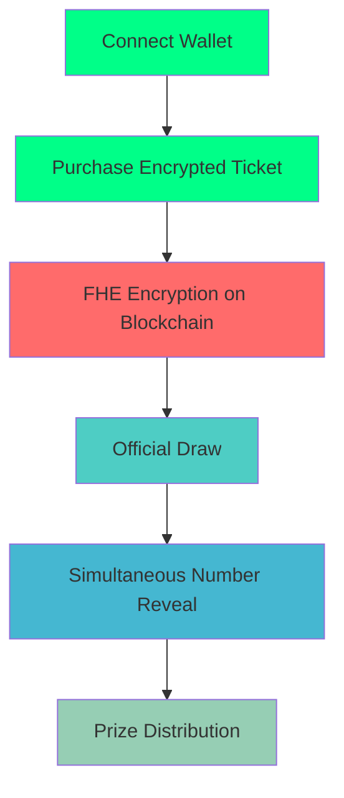

# 🎰 Secret Spin Draw

<div align="center">


**The Future of Fair Gaming is Here**

[](https://vercel.com/new/clone?repository-url=https://github.com/tienvu09/secret-spin-draw)
[](https://opensource.org/licenses/MIT)
[](https://www.typescriptlang.org/)
[](https://reactjs.org/)

</div>

---

## 🚀 What Makes Us Different?

Secret Spin Draw revolutionizes the lottery industry by combining **Fully Homomorphic Encryption (FHE)** with blockchain technology to create the world's most secure and transparent lottery system.

### 🔐 **Privacy-First Design**
- Your ticket numbers are encrypted using FHE before being stored on-chain
- No one can see your numbers until the official draw
- Complete privacy protection with mathematical guarantees

### ⛓️ **Blockchain Transparency**
- All transactions are recorded on Ethereum Sepolia testnet
- Immutable and verifiable lottery results
- Smart contracts ensure fair play

### 🎯 **Provably Fair**
- Cryptographically verifiable randomness
- No manipulation possible
- Mathematical proof of fairness

---

## 🛠️ Tech Stack

<table>
<tr>
<td align="center" width="33%">

<br><b>React 18</b>
</td>
<td align="center" width="33%">

<br><b>TypeScript</b>
</td>
<td align="center" width="33%">

<br><b>Tailwind CSS</b>
</td>
</tr>
<tr>
<td align="center" width="33%">

<br><b>Rainbow Kit</b>
</td>
<td align="center" width="33%">

<br><b>Wagmi</b>
</td>
<td align="center" width="33%">

<br><b>Viem</b>
</td>
</tr>
</table>

---

## 🎮 How It Works



### 1. **Connect Your Wallet** 🔗
- Support for MetaMask, Rainbow, WalletConnect, and more
- Secure connection to Sepolia testnet

### 2. **Purchase Encrypted Tickets** 🎫
- Choose your ticket price and jackpot
- Numbers are encrypted using FHE before storage

### 3. **Wait for the Draw** ⏰
- Your numbers remain completely hidden
- No one can access them until the official draw

### 4. **Reveal and Win** 🏆
- All numbers revealed simultaneously
- Instant prize distribution to winners

---

## 🚀 Quick Start

### Prerequisites
- Node.js 18+ and npm
- A Web3 wallet (MetaMask, Rainbow, etc.)
- Sepolia ETH for testing

### Installation

```bash
# Clone the repository
git clone https://github.com/tienvu09/secret-spin-draw.git
cd secret-spin-draw

# Install dependencies
npm install

# Start development server
npm run dev
```

### Environment Setup

Create a `.env.local` file:

```env
# Chain Configuration
NEXT_PUBLIC_CHAIN_ID=11155111
NEXT_PUBLIC_RPC_URL=https://sepolia.infura.io/v3/YOUR_INFURA_KEY

# Wallet Connect
NEXT_PUBLIC_WALLET_CONNECT_PROJECT_ID=YOUR_WALLET_CONNECT_PROJECT_ID

# Infura (Optional)
NEXT_PUBLIC_INFURA_API_KEY=YOUR_INFURA_API_KEY
```

---

## 🏗️ Smart Contract

Our FHE smart contract ensures:

- **Encrypted Storage**: Ticket numbers encrypted with FHE
- **Fair Selection**: Cryptographically secure random number generation
- **Transparent Results**: All operations verifiable on-chain
- **Secure Distribution**: Automated prize distribution

```solidity
// Example: Purchase encrypted ticket
function purchaseTicket(
    uint256 roundId,
    externalEuint32 ticketNumber,
    bytes calldata inputProof
) public payable returns (uint256)
```

---

## 🎨 Features

### 🔒 **Security Features**
- [x] FHE encryption for ticket numbers
- [x] Blockchain-based transparency
- [x] Smart contract automation
- [x] Multi-signature verification

### 🎮 **User Experience**
- [x] Intuitive wallet connection
- [x] Real-time balance display
- [x] Responsive design
- [x] Mobile-friendly interface

### 🚀 **Performance**
- [x] Fast transaction processing
- [x] Optimized smart contracts
- [x] Efficient FHE operations
- [x] Minimal gas consumption

---

## 📱 Screenshots

<div align="center">

| Homepage | Purchase | Results |
|:--------:|:--------:|:-------:|
|  |  |  |

</div>

---

## 🚀 Deployment

### Vercel (Recommended)

[](https://vercel.com/new/clone?repository-url=https://github.com/tienvu09/secret-spin-draw)

1. Click the deploy button above
2. Set environment variables in Vercel dashboard
3. Deploy automatically

### Manual Deployment

```bash
npm run build
npm run preview
```

For detailed deployment instructions, see [VERCEL_DEPLOYMENT.md](./VERCEL_DEPLOYMENT.md)

---

## 🤝 Contributing

We welcome contributions! Please see our [Contributing Guidelines](CONTRIBUTING.md) for details.

### Development Workflow

```bash
# Fork the repository
git clone https://github.com/YOUR_USERNAME/secret-spin-draw.git

# Create feature branch
git checkout -b feature/amazing-feature

# Make changes and commit
git commit -m "Add amazing feature"

# Push to branch
git push origin feature/amazing-feature

# Open Pull Request
```

---

## 📊 Project Stats

<div align="center">


</div>

---

## 📄 License

This project is licensed under the MIT License - see the [LICENSE](LICENSE) file for details.

---

## 🙏 Acknowledgments

- [FHEVM](https://github.com/fhenixprotocol/fhevm) for FHE implementation
- [Rainbow Kit](https://rainbowkit.com) for wallet integration
- [Wagmi](https://wagmi.sh) for React hooks
- [Viem](https://viem.sh) for TypeScript interface

---

## 📞 Support

- 📧 Email: support@secretspindraw.com
- 🐛 Issues: [GitHub Issues](https://github.com/tienvu09/secret-spin-draw/issues)
- 💬 Discussions: [GitHub Discussions](https://github.com/tienvu09/secret-spin-draw/discussions)

---

<div align="center">

**Made with ❤️ by [tienvu09](https://github.com/tienvu09)**

[](https://github.com/tienvu09)
[](https://twitter.com/secretspindraw)

</div>